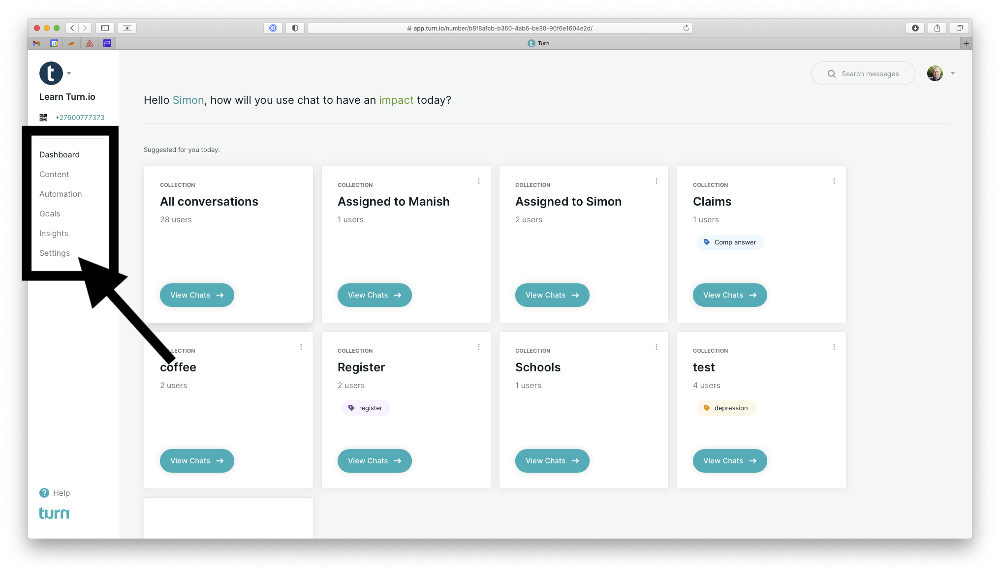
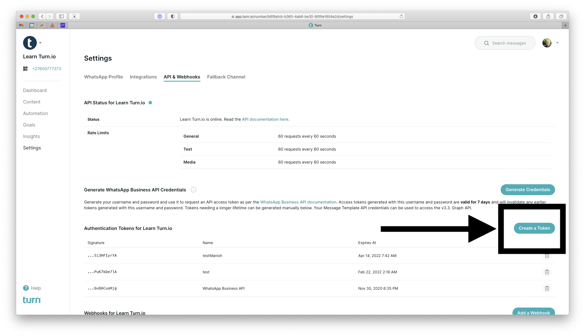
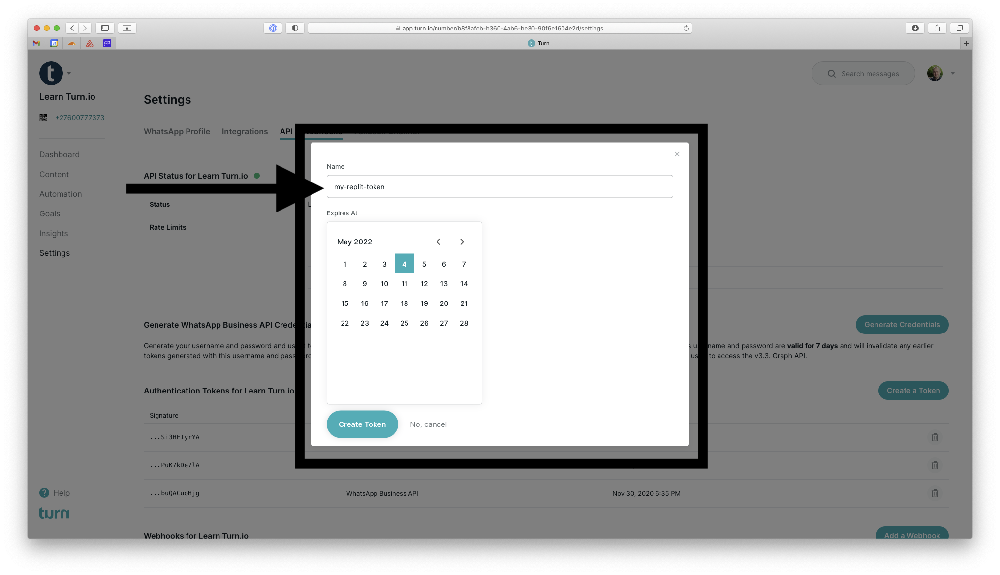
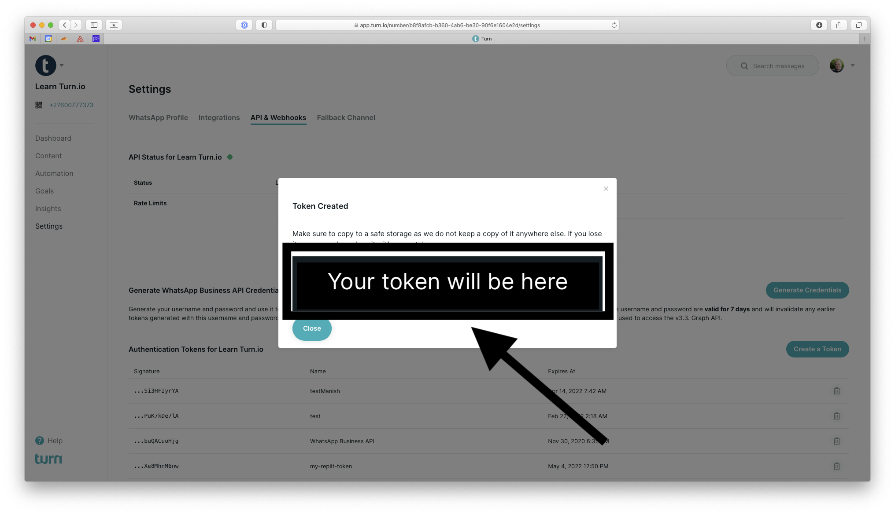
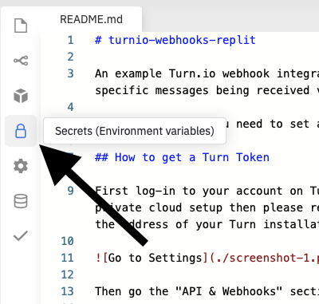
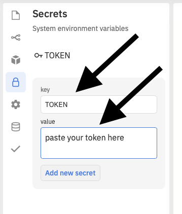
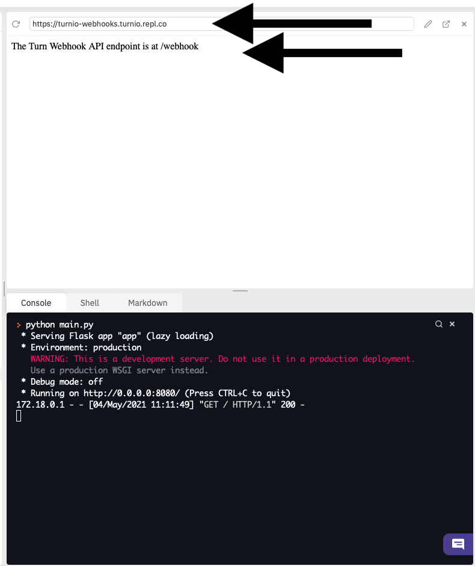
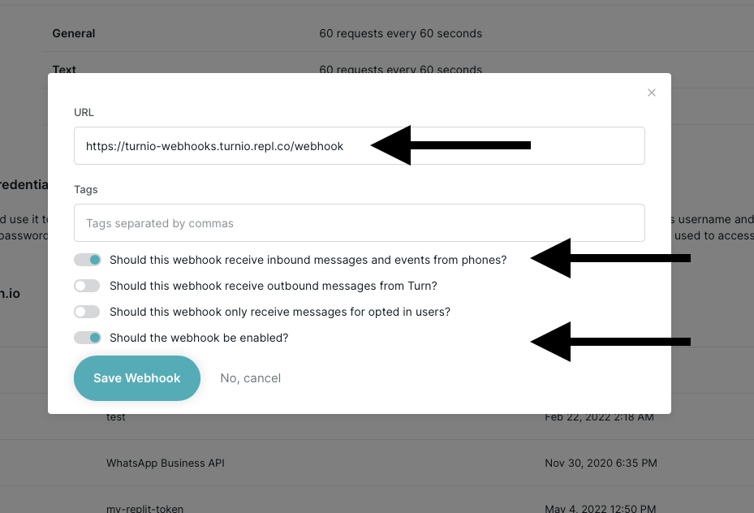

# turnio-webhooks-replit

An example Turn.io webhook integration on Replit. This will return with an automated reply to specific messages being received via webhooks.

For this to work you need to set a Turn API token named `TOKEN` as a secret in Replit.

## How to run this Repl.it example

Click the `Run on Repl.it` button below to install this code example into your Repl.it workspace. Repl.it creates a free workspace for you to do this in.

Then log-in to your account on Turn. For most this will be at https://app.turn.io. If you're on a private cloud setup then please reach out to Turn.io Support via WhatsApp if you're unsure about the address of your Turn installation.

Then go the "API & Webhooks" section and click on the "Create a Token" button.

Provide a suitable name for your token (this is just for your own reference) and specify for how long you would like this token to be valid for. It defaults to being valid for 1 year.

After clicking the "Create Token" button Turn will generate the token for you and display it in the browser. Turn does not store this token for you, make sure to immediately copy the token.

In your Repl.it account, go to "Secrets" 

Create a new entry by typing `TOKEN` into the key field and by pasting the Turn token copied in the previous into the value field.

Finally click the `Add new secret` button and you're all set with setting up the Repl.it application.

Now click the `Run` button at the top of the Repl.it UI to start the application.
After a few seconds, it will display an address in the top right and the output of the webserver running below it.

The address in the screenshot is https://turnio-webhooks.turnio.repl.co but when you run this in your own Repl.it account, it will be something different. Copy that address. Take note that the default example we're providing here is expecting Turn to forward messages to `/webhook` on the URL provided by Repl.it

Now go back to Turn and instruct it to forward incoming messages to the Repl.it URL for your account. You will again find this under `API & Settings` in the Turn UI below the `Create a Token` section.

Make sure you instruct Turn to enable the webhook and to have it forward inbound messages to the webhook.

Click `Save Webhook`

Now any messages you send to your WhatsApp number (this includes any sandbox numbers) will be forwarded by Turn to your webhook.

The default example will attempt to retrieve a result from the [DuckDuckGo](https://duckduckgo.com) search engine and send it as a text reply via WhatsApp.

